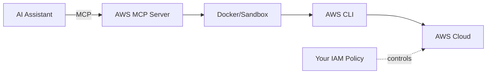

# AWS Model Context Protocol (MCP) Server

[](https://github.com/alexei-led/aws-mcp-server/actions/workflows/ci.yml)
[](https://pypi.org/project/alexei-led.aws-mcp-server/)
[](https://codecov.io/gh/alexei-led/aws-mcp-server)
[](https://github.com/alexei-led/aws-mcp-server)
[](https://github.com/alexei-led/aws-mcp-server/pkgs/container/aws-mcp-server)

A secure MCP server that gives AI assistants access to all 200+ AWS services through two simple tools.

## Why This Approach?

**The problem with wrapping AWS APIs directly:** AWS has 200+ services with thousands of operations. Creating an MCP tool for each would mean massive code, constant maintenance as AWS evolves, and duplicating what AWS CLI already does.

**The solution:** AWS CLI is already a comprehensive, well-documented abstraction over AWS APIs. This project wraps the CLI itself, giving AI assistants:

- **Complete AWS coverage** through just 2 tools (help lookup + command execution)
- **Self-service documentation** via `--help` - the AI learns commands on demand
- **Unix pipe support** for filtering and transforming output (`jq`, `grep`, `sort`, etc.)
- **Zero maintenance** as AWS adds services - the CLI handles it

**Security model:**

- **Host protection**: Docker container or OS sandbox (Landlock/Bubblewrap/Seatbelt) isolates command execution.
- **AWS protection**: Your IAM role/policy - this project relies on AWS IAM for access control.



## Overview

Two tools provide complete AWS access:

| Tool               | Purpose                                                                        |
| :----------------- | :----------------------------------------------------------------------------- |
| `aws_cli_help`     | Get documentation for any AWS service/command. Use this first to learn syntax. |
| `aws_cli_pipeline` | Execute AWS CLI commands, optionally with Unix pipes for output processing.    |

**Recommended workflow:** Help first, then execute. The AI learns command syntax from AWS's built-in help system before running commands.

## Demo

[Demo](https://private-user-images.githubusercontent.com/1898375/424996801-b51ddc8e-5df5-40c4-8509-84c1a7800d62.mp4?jwt=eyJhbGciOiJIUzI1NiIsInR5cCI6IkpXVCJ9.eyJpc3MiOiJnaXRodWIuY29tIiwiYXVkIjoicmF3LmdpdGh1YnVzZXJjb250ZW50LmNvbSIsImtleSI6ImtleTUiLCJleHAiOjE3NDI0NzY5OTUsIm5iZiI6MTc0MjQ3NjY5NSwicGF0aCI6Ii8xODk4Mzc1LzQyNDk5NjgwMS1iNTFkZGM4ZS01ZGY1LTQwYzQtODUwOS04NGMxYTc4MDBkNjIubXA0P1gtQW16LUFsZ29yaXRobT1BV1M0LUhNQUMtU0hBMjU2JlgtQW16LUNyZWRlbnRpYWw9QUtJQVZDT0RZTFNBNTNQUUs0WkElMkYyMDI1MDMyMCUyRnVzLWVhc3QtMSUyRnMzJTJGYXdzNF9yZXF1ZXN0JlgtQW16LURhdGU9MjAyNTAzMjBUMTMxODE1WiZYLUFtei1FeHBpcmVzPTMwMCZYLUFtei1TaWduYXR1cmU9NjgwNTM4MDVjN2U4YjQzN2Y2N2Y5MGVkMThiZTgxYWEyNzBhZTlhMTRjZDY3ZDJmMzJkNmViM2U4M2U4MTEzNSZYLUFtei1TaWduZWRIZWFkZXJzPWhvc3QifQ.tIb7uSkDpSaspIluzCliHS8ATmlzkvEnF3CiClD-UGQ)

## Features

- **Command Documentation** - Detailed help information for AWS CLI commands
- **Command Execution** - Execute AWS CLI commands and return human-readable results
- **Unix Pipe Support** - Filter and transform AWS CLI output using standard Unix pipes and utilities
- **AWS Resources Context** - Access to AWS profiles, regions, account information, and environment details via MCP Resources
- **Prompt Templates** - Pre-defined prompt templates for common AWS tasks following best practices
- **Docker Integration** - Simple deployment through containerization with multi-architecture support
- **AWS Authentication** - Leverages existing AWS credentials on the host machine

## Documentation

- **[Usage Guide](docs/USAGE.md)**: Detailed instructions on integration, tools, resources, and prompts.
- **[Security Architecture](docs/SECURITY.md)**: Three-layer security model (IAM + Sandbox + Docker).
- **[Security Policy](SECURITY.md)**: Vulnerability reporting and supported versions.
- **[Development Guide](docs/DEVELOPMENT.md)**: Setup, testing, and contribution.
- **[Version Management](docs/VERSION.md)**: Git-based versioning details.

## Getting Started

### Option 1: Using Docker (Recommended)

Running inside Docker provides the strongest isolation and security.

```bash
docker run -i --rm \
  -v ~/.aws:/home/appuser/.aws:ro \
  ghcr.io/alexei-led/aws-mcp-server:latest
```

The image supports both AMD64 and ARM64 (Apple Silicon/Graviton).

### Option 2: Using uvx (Quick)

Run directly without installation:

```bash
uvx alexei-led.aws-mcp-server
```

### Option 3: Using pip

**Caution:** Running natively requires careful environment setup. Review [Security Considerations](#security-considerations).

```bash
pip install alexei-led.aws-mcp-server
aws-mcp-server
```

## Configuration

The AWS MCP Server can be configured using environment variables:

| Environment Variable          | Description                                       | Default   |
| :---------------------------- | :------------------------------------------------ | :-------- |
| `AWS_MCP_TIMEOUT`             | Command execution timeout in seconds              | 300       |
| `AWS_MCP_MAX_OUTPUT`          | Maximum output size in characters                 | 100000    |
| `AWS_MCP_TRANSPORT`           | Transport protocol ("stdio" or "sse")             | stdio     |
| `AWS_PROFILE`                 | AWS profile to use                                | default   |
| `AWS_REGION`                  | AWS region to use                                 | us-east-1 |
| `AWS_MCP_SANDBOX`             | Sandbox mode ("auto", "disabled", "required")     | auto      |
| `AWS_MCP_SANDBOX_CREDENTIALS` | Credentials passing ("env", "aws_config", "both") | both      |

## Security Considerations

Security is paramount. While the server provides sandboxing, **you are responsible** for:

1. **Deployment**: Use Docker for the strongest filesystem and process isolation.
2. **Least Privilege**: Ensure the AWS credentials provided to the server have only the minimum necessary permissions. **Never use root credentials.**
3. **Trusted User**: Only expose this server to trusted users (yourself).

For a detailed security analysis, including the Trusted User Model and Sandbox vs Docker comparison, please read the **[Security Architecture](docs/SECURITY.md)**.

## Usage & Integration

For instructions on integrating with **Claude Desktop**, examples of **Tools** and **Prompts**, and using **Resources**, see the **[Usage Guide](docs/USAGE.md)**.

## Development

See **[Development Guide](docs/DEVELOPMENT.md)** for project setup and testing.

## License

This project is licensed under the MIT License - see the LICENSE file for details.
