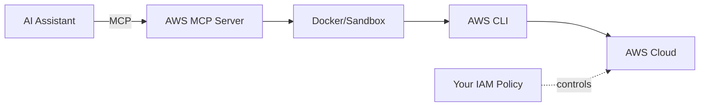
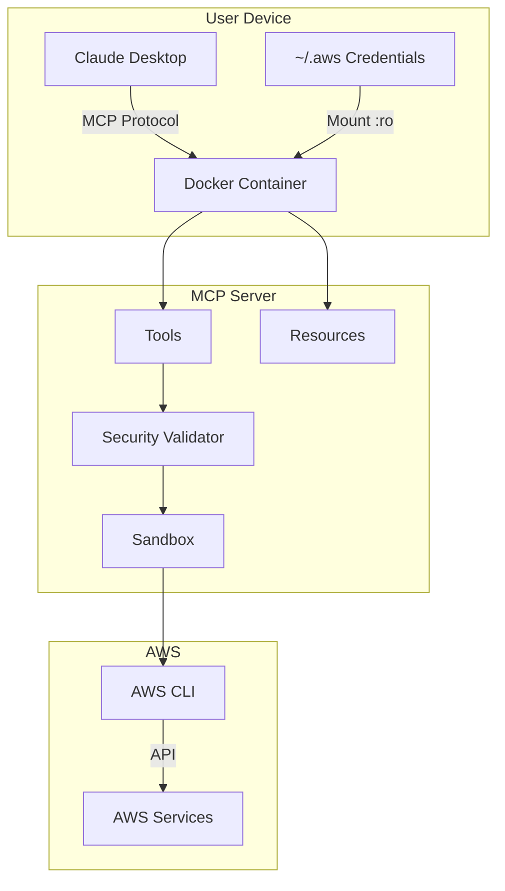

# AWS Model Context Protocol (MCP) Server

[](https://github.com/alexei-led/aws-mcp-server/actions/workflows/ci.yml)
[](https://codecov.io/gh/alexei-led/aws-mcp-server)
[](https://github.com/alexei-led/aws-mcp-server)
[](https://github.com/alexei-led/aws-mcp-server/pkgs/container/aws-mcp-server)

A secure MCP server that gives AI assistants access to all 200+ AWS services through two simple tools.

## Why This Approach?

**The problem with wrapping AWS APIs directly:** AWS has 200+ services with thousands of operations. Creating an MCP tool for each would mean massive code, constant maintenance as AWS evolves, and duplicating what AWS CLI already does.

**The solution:** AWS CLI is already a comprehensive, well-documented abstraction over AWS APIs. This project wraps the CLI itself, giving AI assistants:

- **Complete AWS coverage** through just 2 tools (help lookup + command execution)
- **Self-service documentation** via `--help` - the AI learns commands on demand
- **Unix pipe support** for filtering and transforming output (`jq`, `grep`, `sort`, etc.)
- **Zero maintenance** as AWS adds services - the CLI handles it

**Security model:**

- **Host protection**: Docker container or OS sandbox (Landlock/Bubblewrap/Seatbelt) isolates command execution from your machine
- **AWS protection**: Your IAM role/policy - this project doesn't try to replace IAM, it relies on it



## Overview

Two tools provide complete AWS access:

| Tool               | Purpose                                                                        |
| ------------------ | ------------------------------------------------------------------------------ |
| `aws_cli_help`     | Get documentation for any AWS service/command. Use this first to learn syntax. |
| `aws_cli_pipeline` | Execute AWS CLI commands, optionally with Unix pipes for output processing.    |

**Recommended workflow:** Help first, then execute. The AI learns command syntax from AWS's built-in help system before running commands.

## Demo

[Demo](https://private-user-images.githubusercontent.com/1898375/424996801-b51ddc8e-5df5-40c4-8509-84c1a7800d62.mp4?jwt=eyJhbGciOiJIUzI1NiIsInR5cCI6IkpXVCJ9.eyJpc3MiOiJnaXRodWIuY29tIiwiYXVkIjoicmF3LmdpdGh1YnVzZXJjb250ZW50LmNvbSIsImtleSI6ImtleTUiLCJleHAiOjE3NDI0NzY5OTUsIm5iZiI6MTc0MjQ3NjY5NSwicGF0aCI6Ii8xODk4Mzc1LzQyNDk5NjgwMS1iNTFkZGM4ZS01ZGY1LTQwYzQtODUwOS04NGMxYTc4MDBkNjIubXA0P1gtQW16LUFsZ29yaXRobT1BV1M0LUhNQUMtU0hBMjU2JlgtQW16LUNyZWRlbnRpYWw9QUtJQVZDT0RZTFNBNTNQUUs0WkElMkYyMDI1MDMyMCUyRnVzLWVhc3QtMSUyRnMzJTJGYXdzNF9yZXF1ZXN0JlgtQW16LURhdGU9MjAyNTAzMjBUMTMxODE1WiZYLUFtei1FeHBpcmVzPTMwMCZYLUFtei1TaWduYXR1cmU9NjgwNTM4MDVjN2U4YjQzN2Y2N2Y5MGVkMThiZTgxYWEyNzBhZTlhMTRjZDY3ZDJmMzJkNmViM2U4M2U4MTEzNSZYLUFtei1TaWduZWRIZWFkZXJzPWhvc3QifQ.tIb7uSkDpSaspIluzCliHS8ATmlzkvEnF3CiClD-UGQ)

## Features

- **Command Documentation** - Detailed help information for AWS CLI commands
- **Command Execution** - Execute AWS CLI commands and return human-readable results
- **Unix Pipe Support** - Filter and transform AWS CLI output using standard Unix pipes and utilities
- **AWS Resources Context** - Access to AWS profiles, regions, account information, and environment details via MCP Resources
- **Prompt Templates** - Pre-defined prompt templates for common AWS tasks following best practices
- **Docker Integration** - Simple deployment through containerization with multi-architecture support (AMD64/x86_64 and ARM64)
- **AWS Authentication** - Leverages existing AWS credentials on the host machine

## Documentation

| Document                                  | Description                                                           |
| ----------------------------------------- | --------------------------------------------------------------------- |
| [Security Architecture](docs/SECURITY.md) | Command validation, sandbox execution, blocked commands, custom rules |
| [Development Guide](docs/DEVELOPMENT.md)  | Setup, testing, code style, project structure                         |
| [Version Management](docs/VERSION.md)     | Git-based versioning with setuptools_scm                              |
| [Contributing](CONTRIBUTING.md)           | How to contribute to this project                                     |
| [Security Policy](SECURITY.md)            | Vulnerability reporting                                               |

## Requirements

- Docker (default) or Python 3.13+ (and AWS CLI installed locally)
- AWS credentials configured

## Getting Started

**Note:** For security and reliability, running the server inside a Docker container is the **strongly recommended** method. Please review the [Security Considerations](#security-considerations) section for important considerations.

### Run Server Option 1: Using Docker (Recommended)

```bash
# Clone repository
git clone https://github.com/alexei-led/aws-mcp-server.git
cd aws-mcp-server

# Build and run Docker container
docker compose -f deploy/docker/docker-compose.yml up -d
```

The Docker image supports both AMD64/x86_64 (Intel/AMD) and ARM64 (Apple Silicon M1-M4, AWS Graviton) architectures.

> **Note**: The official image from GitHub Packages is multi-architecture and will automatically use the appropriate version for your system.
>
> ```bash
> # Use the latest stable version
> docker pull ghcr.io/alexei-led/aws-mcp-server:latest
>
> # Or pin to a specific version (recommended for production)
> docker pull ghcr.io/alexei-led/aws-mcp-server:1.0.0
> ```
>
> **Docker Image Tags**:
>
> - `latest`: Latest stable release
> - `x.y.z` (e.g., `1.0.0`): Specific version
> - `sha-<commit-sha>`: Development builds, tagged with Git commit SHA (e.g., `sha-gb697684`)

### Run Server Option 2: Using Python

**Use with Caution:** Running natively requires careful environment setup and carries higher security risks compared to the recommended Docker deployment. Ensure you understand the implications outlined in the [Security Considerations](#security-considerations) section.

```bash
# Clone repository
git clone https://github.com/alexei-led/aws-mcp-server.git
cd aws-mcp-server

# Set up virtual environment
python -m venv venv
source venv/bin/activate  # On Windows: venv\Scripts\activate

# Install in development mode
pip install -e .

# Run the server
python -m aws_mcp_server
```

## Configuration

The AWS MCP Server can be configured using environment variables:

| Environment Variable          | Description                                                          | Default   |
| ----------------------------- | -------------------------------------------------------------------- | --------- |
| `AWS_MCP_TIMEOUT`             | Command execution timeout in seconds                                 | 300       |
| `AWS_MCP_MAX_OUTPUT`          | Maximum output size in characters                                    | 100000    |
| `AWS_MCP_TRANSPORT`           | Transport protocol to use ("stdio" or "sse")                         | stdio     |
| `AWS_PROFILE`                 | AWS profile to use                                                   | default   |
| `AWS_REGION`                  | AWS region to use                                                    | us-east-1 |
| `AWS_MCP_SECURITY_MODE`       | Security mode ("strict" or "permissive")                             | strict    |
| `AWS_MCP_SECURITY_CONFIG`     | Path to custom security configuration file                           | ""        |
| `AWS_MCP_SANDBOX`             | Sandbox mode ("auto", "disabled", "required")                        | auto      |
| `AWS_MCP_SANDBOX_CREDENTIALS` | How to pass AWS credentials to sandbox ("env", "aws_config", "both") | both      |

**Important:** Securely manage the AWS credentials provided to the server, whether via mounted `~/.aws` files or environment variables. Ensure the credentials follow the principle of least privilege as detailed in the [Security Considerations](#security-considerations) section. When running via Docker, ensure these variables are passed correctly to the container environment (e.g., using `docker run -e VAR=value ...`).

## Security Considerations

Security is paramount when executing commands against your AWS environment. While AWS MCP Server provides functionality, **you are responsible** for configuring and running it securely. Please adhere strictly to the following:

### 1. Recommended Deployment: Docker Container

- **Isolation:** Running the server inside a Docker container is the **strongly recommended and default** deployment method. Containerization provides crucial filesystem and process isolation. Potentially destructive Unix commands (like `rm`, `mv`) executed via pipes, even if misused, will be contained within the ephemeral Docker environment and will **not** affect your host machine's filesystem. The container can be easily stopped and recreated.
- **Controlled Environment:** Docker ensures a consistent environment with necessary dependencies, reducing unexpected behavior.

### 2. AWS Credentials and IAM Least Privilege (Critical)

- **User Responsibility:** You provide the AWS credentials to the server (via mounted `~/.aws` or environment variables).
- **Least Privilege is Essential:** The server executes AWS CLI commands _using the credentials you provide_. It is **absolutely critical** that these credentials belong to an IAM principal (User or Role) configured with the **minimum necessary permissions** (least privilege) for _only_ the AWS actions you intend to perform through this tool.
  - **Do Not Use Root Credentials:** Never use AWS account root user credentials.
  - **Regularly Review Permissions:** Periodically audit the IAM permissions associated with the credentials.
- **Impact Limitation:** Properly configured IAM permissions are the **primary mechanism** for limiting the potential impact of _any_ command executed via the server, whether intended or unintended. Even if a command were manipulated, it could only perform actions allowed by the specific IAM policy.

### 3. Trusted User Model

- The server assumes the end-user interacting with the MCP client (e.g., Claude Desktop, Cursor) is the **same trusted individual** who configured the server and provided the least-privilege AWS credentials. Do not expose the server or connected client to untrusted users.

### 4. Understanding Execution Risks (Current Implementation)

- **Command Execution:** The current implementation uses shell features (`shell=True` in subprocess calls) to execute AWS commands and handle Unix pipes. While convenient, this approach carries inherent risks if the input command string were manipulated (command injection).
- **Mitigation via Operational Controls:** In the context of the **trusted user model** and **Docker deployment**, these risks are mitigated operationally:
  - The trusted user is assumed not to provide intentionally malicious commands against their own environment.
  - Docker contains filesystem side-effects.
  - **Crucially, IAM least privilege limits the scope of _any_ AWS action that could be executed.**
- **Credential Exfiltration Risk:** Despite containerization and IAM, a sophisticated command injection could potentially attempt to read the mounted credentials (`~/.aws`) or environment variables within the container and exfiltrate them (e.g., via `curl`). **Strict IAM policies remain the most vital defense** to limit the value of potentially exfiltrated credentials.

### 5. Network Exposure (SSE Transport)

- If using the `sse` transport (which implies a network listener), ensure you bind the server only to trusted network interfaces (e.g., `localhost`) or implement appropriate network security controls (firewalls, authentication proxies) if exposing it more broadly. The default `stdio` transport does not open network ports.

### 6. Shared Responsibility Summary

- **AWS MCP Server provides the tool.**
- **You, the user, are responsible for:**
  - Running it within the recommended secure Docker environment.
  - Providing and securely managing **least-privilege** AWS credentials.
  - Ensuring only trusted users interact with the server/client.
  - Securing the network environment if applicable.

By strictly adhering to Docker deployment and meticulous IAM least-privilege configuration, you establish the necessary operational controls for using the AWS MCP Server securely with its current implementation.

## Integrating with Claude Desktop

### Setup

To manually integrate AWS MCP Server with Claude Desktop:

1. **Locate the Claude Desktop configuration file**:
   - macOS: `~/Library/Application Support/Claude/claude_desktop_config.json`
   - Windows: `%APPDATA%\Claude\claude_desktop_config.json`

2. **Edit the configuration file** to include the AWS MCP Server:

   ```json
   {
     "mcpServers": {
       "aws-mcp-server": {
         "command": "docker",
         "args": [
           "run",
           "-i",
           "--rm",
           "-v",
           "/Users/YOUR_USER_NAME/.aws:/home/appuser/.aws:ro",
           "ghcr.io/alexei-led/aws-mcp-server:latest"
         ]
       }
     }
   }
   ```

3. **Restart Claude Desktop** to apply the changes
   - After restarting, you should see a hammer 🔨 icon in the bottom right corner of the input box
   - This indicates that the AWS MCP Server is available for use



### Example Interactions

**Get CLI help:**

```text
User: How do I copy files to S3?
Claude: [uses aws_cli_help tool] → Returns aws s3 cp documentation
```

**Execute commands:**

```text
User: List my S3 buckets
Claude: [uses aws_cli_pipeline tool] → aws s3 ls
```

**Use pipes:**

```text
User: Show running EC2 instances sorted by launch time
Claude: [uses aws_cli_pipeline tool] → aws ec2 describe-instances ... | jq 'sort_by(.LaunchTime)'
```

**Access resources:**

```text
User: What region am I using?
Claude: [reads aws://config/environment resource] → Shows current profile and region
```

## Available Prompt Templates

The AWS MCP Server includes the following pre-defined prompt templates:

### Core Operations

| Prompt                 | Description                                                   | Parameters                       |
| ---------------------- | ------------------------------------------------------------- | -------------------------------- |
| `create_resource`      | Generate commands to create AWS resources with best practices | `resource_type`, `resource_name` |
| `resource_inventory`   | Create comprehensive inventory of resources                   | `service`, `region` (optional)   |
| `troubleshoot_service` | Generate commands to troubleshoot service issues              | `service`, `resource_id`         |
| `resource_cleanup`     | Identify and safely clean up resources                        | `service`, `criteria` (optional) |

### Security & Compliance

| Prompt                        | Description                                                   | Parameters                                          |
| ----------------------------- | ------------------------------------------------------------- | --------------------------------------------------- |
| `security_audit`              | Audit security settings for a specific AWS service            | `service`                                           |
| `security_posture_assessment` | Comprehensive security assessment across your AWS environment | None                                                |
| `iam_policy_generator`        | Create least-privilege IAM policies                           | `service`, `actions`, `resource_pattern` (optional) |
| `compliance_check`            | Check compliance with standards                               | `compliance_standard`, `service` (optional)         |

### Cost & Performance

| Prompt               | Description                                        | Parameters               |
| -------------------- | -------------------------------------------------- | ------------------------ |
| `cost_optimization`  | Find cost optimization opportunities for a service | `service`                |
| `performance_tuning` | Optimize and tune performance of AWS resources     | `service`, `resource_id` |

### Infrastructure & Architecture

| Prompt                      | Description                                        | Parameters                                     |
| --------------------------- | -------------------------------------------------- | ---------------------------------------------- |
| `serverless_deployment`     | Deploy serverless applications with best practices | `application_name`, `runtime` (optional)       |
| `container_orchestration`   | Set up container environments (ECS/EKS)            | `cluster_name`, `service_type` (optional)      |
| `vpc_network_design`        | Design and implement secure VPC networking         | `vpc_name`, `cidr_block` (optional)            |
| `infrastructure_automation` | Automate infrastructure management                 | `resource_type`, `automation_scope` (optional) |
| `multi_account_governance`  | Implement secure multi-account strategies          | `account_type` (optional)                      |

### Reliability & Monitoring

| Prompt               | Description                             | Parameters                                       |
| -------------------- | --------------------------------------- | ------------------------------------------------ |
| `service_monitoring` | Set up comprehensive monitoring         | `service`, `metric_type` (optional)              |
| `disaster_recovery`  | Implement enterprise-grade DR solutions | `service`, `recovery_point_objective` (optional) |

## Security

The AWS MCP Server implements multi-layered security:

1. **Command Validation** - Blocks dangerous commands (IAM modifications, audit tampering, etc.)
2. **Sandbox Execution** - OS-level isolation for native deployments (Landlock/Bubblewrap on Linux, Seatbelt on macOS)
3. **Safe Patterns** - Allows read-only operations (`get-`, `list-`, `describe-`)

For detailed security architecture, blocked commands, sandbox configuration, and custom rules, see **[Security Architecture](docs/SECURITY.md)**.

## Development

See **[Development Guide](docs/DEVELOPMENT.md)** for:

- Setting up the development environment
- Running tests and coverage
- Code style and linting
- Project structure

## Troubleshooting

- **Authentication Issues**: Ensure your AWS credentials are properly configured
- **Connection Errors**: Verify the server is running and AI assistant connection settings are correct
- **Permission Errors**: Check that your AWS credentials have the necessary permissions
- **Timeout Errors**: For long-running commands, increase the `AWS_MCP_TIMEOUT` environment variable

## Why Deploy with Docker

Docker is the **recommended deployment method** because it provides stronger isolation than OS-level sandboxing:

| Aspect                | Docker                    | Sandbox (Landlock/Seatbelt) |
| --------------------- | ------------------------- | --------------------------- |
| Filesystem isolation  | Full container filesystem | Path-based restrictions     |
| Process isolation     | Separate namespaces       | Same user space             |
| Network isolation     | Configurable              | Network access required     |
| Credential protection | Read-only mount (`:ro`)   | Read access to `~/.aws`     |
| Cleanup               | Container removed on exit | No automatic cleanup        |

### Key Benefits

- **Stronger Security**: Container provides full filesystem and process isolation; destructive commands only affect container
- **Consistent Environment**: AWS CLI, SSM plugin, jq pre-installed; no version conflicts
- **Multi-Architecture**: Supports AMD64/x86_64 and ARM64 (Apple Silicon, Graviton)
- **Simple Updates**: `docker pull` for new versions; pin specific versions for stability

When running natively (without Docker), enable sandbox mode (`AWS_MCP_SANDBOX=auto`) for defense-in-depth.

## Versioning

This project uses [setuptools_scm](https://github.com/pypa/setuptools_scm) for automatic versioning from Git tags. Release versions match tags exactly (e.g., `1.2.3`), while development versions include commit info.

To create a release: `git tag -a 1.2.3 -m "Release 1.2.3" && git push origin 1.2.3`

See **[Version Management](docs/VERSION.md)** for details.

## License

This project is licensed under the MIT License - see the LICENSE file for details.
