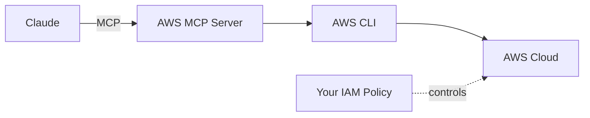

# AWS MCP Server

[](https://github.com/alexei-led/aws-mcp-server/actions/workflows/ci.yml)
[](https://pypi.org/project/aws-mcp/)
[](https://codecov.io/gh/alexei-led/aws-mcp-server)
[](https://github.com/alexei-led/aws-mcp-server)
[](https://github.com/alexei-led/aws-mcp-server/pkgs/container/aws-mcp-server)

Give Claude access to all 200+ AWS services through the AWS CLI.

## Demo

[Demo](https://private-user-images.githubusercontent.com/1898375/424996801-b51ddc8e-5df5-40c4-8509-84c1a7800d62.mp4?jwt=eyJhbGciOiJIUzI1NiIsInR5cCI6IkpXVCJ9.eyJpc3MiOiJnaXRodWIuY29tIiwiYXVkIjoicmF3LmdpdGh1YnVzZXJjb250ZW50LmNvbSIsImtleSI6ImtleTUiLCJleHAiOjE3NDI0NzY5OTUsIm5iZiI6MTc0MjQ3NjY5NSwicGF0aCI6Ii8xODk4Mzc1LzQyNDk5NjgwMS1iNTFkZGM4ZS01ZGY1LTQwYzQtODUwOS04NGMxYTc4MDBkNjIubXA0P1gtQW16LUFsZ29yaXRobT1BV1M0LUhNQUMtU0hBMjU2JlgtQW16LUNyZWRlbnRpYWw9QUtJQVZDT0RZTFNBNTNQUUs0WkElMkYyMDI1MDMyMCUyRnVzLWVhc3QtMSUyRnMzJTJGYXdzNF9yZXF1ZXN0JlgtQW16LURhdGU9MjAyNTAzMjBUMTMxODE1WiZYLUFtei1FeHBpcmVzPTMwMCZYLUFtei1TaWduYXR1cmU9NjgwNTM4MDVjN2U4YjQzN2Y2N2Y5MGVkMThiZTgxYWEyNzBhZTlhMTRjZDY3ZDJmMzJkNmViM2U4M2U4MTEzNSZYLUFtei1TaWduZWRIZWFkZXJzPWhvc3QifQ.tIb7uSkDpSaspIluzCliHS8ATmlzkvEnF3CiClD-UGQ)

## What It Does

This MCP server lets Claude run AWS CLI commands on your behalf. Instead of wrapping each AWS API individually, it wraps the CLI itself—giving Claude complete AWS access through just two tools:

| Tool               | Purpose                                                           |
| ------------------ | ----------------------------------------------------------------- |
| `aws_cli_help`     | Get documentation for any AWS command                             |
| `aws_cli_pipeline` | Execute AWS CLI commands with optional pipes (`jq`, `grep`, etc.) |

Claude learns commands on-demand using `--help`, then executes them. Your IAM policy controls what it can actually do.



## Quick Start

### Prerequisites

- [AWS CLI](https://docs.aws.amazon.com/cli/latest/userguide/getting-started-install.html) installed
- AWS credentials configured (see [AWS Credentials](#aws-credentials))
- [uv](https://docs.astral.sh/uv/getting-started/installation/) installed (for `uvx`)

### Claude Code

Add to your MCP settings (Cmd+Shift+P → "Claude: Open MCP Config"):

```json
{
  "mcpServers": {
    "aws": {
      "command": "uvx",
      "args": ["aws-mcp"]
    }
  }
}
```

### Claude Desktop

Add to your Claude Desktop config file:

**macOS**: `~/Library/Application Support/Claude/claude_desktop_config.json`
**Windows**: `%APPDATA%\Claude\claude_desktop_config.json`

```json
{
  "mcpServers": {
    "aws": {
      "command": "uvx",
      "args": ["aws-mcp"]
    }
  }
}
```

### Docker (More Secure)

Docker provides stronger isolation by running commands in a container:

```json
{
  "mcpServers": {
    "aws": {
      "command": "docker",
      "args": [
        "run",
        "-i",
        "--rm",
        "-v",
        "~/.aws:/home/appuser/.aws:ro",
        "ghcr.io/alexei-led/aws-mcp-server:latest"
      ]
    }
  }
}
```

> **Note**: Replace `~/.aws` with the full path on Windows (e.g., `C:\Users\YOU\.aws`).

### Docker with Streamable HTTP Transport

For web-based MCP clients, use the `streamable-http` transport:

```bash
docker run --rm -p 8000:8000 \
  -e AWS_MCP_TRANSPORT=streamable-http \
  -v ~/.aws:/home/appuser/.aws:ro \
  ghcr.io/alexei-led/aws-mcp-server:latest
```

The server will be available at `http://localhost:8000/mcp`.

> **Note**: The `sse` transport is deprecated. Use `streamable-http` instead.

## AWS Credentials

The server uses the standard AWS credential chain. Your credentials are discovered automatically from:

1. **Environment variables**: `AWS_ACCESS_KEY_ID`, `AWS_SECRET_ACCESS_KEY`
2. **Credentials file**: `~/.aws/credentials`
3. **Config file**: `~/.aws/config` (for profiles and region)
4. **IAM role**: When running on EC2, ECS, or Lambda

To use a specific profile:

```json
{
  "mcpServers": {
    "aws": {
      "command": "uvx",
      "args": ["aws-mcp"],
      "env": {
        "AWS_PROFILE": "my-profile"
      }
    }
  }
}
```

## Configuration

### AWS Settings

| Environment Variable          | Description                                    | Default              |
| ----------------------------- | ---------------------------------------------- | -------------------- |
| `AWS_PROFILE`                 | AWS profile to use                             | `default`            |
| `AWS_REGION`                  | AWS region (also accepts `AWS_DEFAULT_REGION`) | `us-east-1`          |
| `AWS_CONFIG_FILE`             | Custom path to AWS config file                 | `~/.aws/config`      |
| `AWS_SHARED_CREDENTIALS_FILE` | Custom path to credentials file                | `~/.aws/credentials` |

### Server Settings

| Environment Variable          | Description                                      | Default  |
| ----------------------------- | ------------------------------------------------ | -------- |
| `AWS_MCP_TIMEOUT`             | Command execution timeout in seconds             | `300`    |
| `AWS_MCP_MAX_OUTPUT`          | Maximum output size in characters                | `100000` |
| `AWS_MCP_TRANSPORT`           | Transport protocol (`stdio`, `sse`, or `streamable-http`) | `stdio`  |
| `AWS_MCP_SANDBOX`             | Sandbox mode (`auto`, `disabled`, `required`)    | `auto`   |
| `AWS_MCP_SANDBOX_CREDENTIALS` | Credential passing (`env`, `aws_config`, `both`) | `both`   |

## Security

**Your IAM policy is your security boundary.** This server executes whatever AWS commands Claude requests—IAM controls what actually succeeds.

Best practices:

- Use a **least-privilege IAM role** (only permissions Claude needs)
- **Never use root credentials**
- Consider **Docker** for additional host isolation

For detailed security architecture, see [Security Documentation](docs/SECURITY.md).

## Documentation

- [Usage Guide](docs/USAGE.md) — Tools, resources, and prompt templates
- [Security Architecture](docs/SECURITY.md) — IAM + Sandbox + Docker model
- [Development Guide](docs/DEVELOPMENT.md) — Contributing and testing

## License

MIT License — see [LICENSE](LICENSE) for details.
