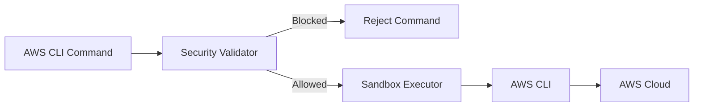

# Security Architecture

This document provides comprehensive information about the AWS MCP Server's security architecture, command validation, and sandbox execution features.

## Security Model Overview



Security is paramount when executing commands against your AWS environment. The AWS MCP Server implements multiple layers of defense:

1. **Command Validation** - Validates commands before execution
2. **Sandbox Execution** - OS-level process isolation
3. **IAM Permissions** - AWS-side access control

## Security Modes

Configure via `AWS_MCP_SECURITY_MODE` environment variable:

| Mode         | Behavior                                         |
| ------------ | ------------------------------------------------ |
| `strict`     | Blocks dangerous commands (default, recommended) |
| `permissive` | Logs warnings but allows execution (use caution) |

## Command Validation System

The server validates all AWS CLI commands through a three-layer system:

### 1. Basic Command Structure

- Verifies commands start with 'aws' prefix and contain a valid service
- Ensures proper command syntax

### 2. Security-Focused Command Filtering

- **Dangerous Commands**: Blocks commands that could compromise security
- **Safe Patterns**: Explicitly allows read-only operations needed for normal use
- **Regex Pattern Matching**: Prevents complex security risks with pattern matching

### 3. Pipe Command Security

- Validates Unix commands used in pipes
- Restricts commands to a safe allowlist
- Prevents filesystem manipulation and arbitrary command execution

## Default Blocked Commands

The default security configuration focuses on preventing the following attack vectors:

### Identity and Access Management (IAM)

| Blocked Command                     | Security Risk                                                |
| ----------------------------------- | ------------------------------------------------------------ |
| `aws iam create-user`               | Creates potential backdoor accounts with persistent access   |
| `aws iam create-access-key`         | Creates long-term credentials that can be stolen or misused  |
| `aws iam attach-*-policy`           | Potential privilege escalation via policy attachments        |
| `aws iam put-user-policy`           | Inline policies can grant excessive permissions              |
| `aws iam create-policy`             | Creating new policies with potentially dangerous permissions |
| `aws iam create-login-profile`      | Creates console passwords for existing users                 |
| `aws iam deactivate-mfa-device`     | Disables multi-factor authentication, weakening security     |
| `aws iam update-assume-role-policy` | Modifies trust relationships, enabling privilege escalation  |

### Audit and Logging

| Blocked Command                            | Security Risk                                        |
| ------------------------------------------ | ---------------------------------------------------- |
| `aws cloudtrail delete-trail`              | Removes audit trail of AWS activity                  |
| `aws cloudtrail stop-logging`              | Stops collecting activity logs, creating blind spots |
| `aws cloudtrail update-trail`              | Can redirect or modify logging configuration         |
| `aws config delete-configuration-recorder` | Disables AWS Config recording of resource changes    |
| `aws guardduty delete-detector`            | Disables threat detection capabilities               |

### Sensitive Data Protection

| Blocked Command                       | Security Risk                                            |
| ------------------------------------- | -------------------------------------------------------- |
| `aws secretsmanager put-secret-value` | Modifies sensitive credentials                           |
| `aws secretsmanager delete-secret`    | Removes sensitive credentials                            |
| `aws kms schedule-key-deletion`       | Schedules deletion of encryption keys, risking data loss |
| `aws kms disable-key`                 | Disables encryption keys, potentially exposing data      |
| `aws s3api put-bucket-policy`         | Can create public S3 buckets, exposing data              |
| `aws s3api delete-bucket-policy`      | Removes protective policies from buckets                 |

### Network Security

| Blocked Command                            | Security Risk                                              |
| ------------------------------------------ | ---------------------------------------------------------- |
| `aws ec2 authorize-security-group-ingress` | Opens inbound network access, potential exposure           |
| `aws ec2 authorize-security-group-egress`  | Opens outbound network access, potential data exfiltration |
| `aws ec2 modify-instance-attribute`        | Can alter security properties of instances                 |

### Safe Patterns (Always Allowed)

Many read-only operations are explicitly allowed:

- All `get-`, `list-`, and `describe-` commands
- All help commands (`--help`, `help`)
- Simulation and testing commands (e.g., `aws iam simulate-custom-policy`)

## Sandbox Execution

When running outside of Docker, the AWS MCP Server provides OS-level process isolation through sandboxing.

### Supported Backends

| Platform | Backend      | Requirements                                         |
| -------- | ------------ | ---------------------------------------------------- |
| Linux    | Landlock LSM | Kernel 5.13+ with Landlock enabled                   |
| Linux    | Bubblewrap   | `bwrap` installed (fallback if Landlock unavailable) |
| macOS    | Seatbelt     | Built-in (sandbox-exec)                              |

### Sandbox Modes

Configure via `AWS_MCP_SANDBOX` environment variable:

| Mode       | Behavior                                                                 |
| ---------- | ------------------------------------------------------------------------ |
| `auto`     | Use sandbox if available, fallback to unsandboxed with warning (default) |
| `disabled` | Never use sandbox (rely on Docker or other isolation)                    |
| `required` | Fail if sandbox is unavailable OR if sandbox fails to apply at runtime   |

**Note on `required` mode**: This mode provides fail-safe behavior. If the sandbox backend (e.g., Landlock) fails to apply restrictions at execution time, the command will fail rather than running unsandboxed. Use this mode when you need guaranteed isolation.

### Sandbox Restrictions

When sandboxing is active, commands run with:

- **Read-only access** to system paths (`/usr`, `/bin`, `/lib`, `/etc`)
- **Write access** limited to `/tmp` and the current directory
- **Network access** enabled (required for AWS API calls)
- **AWS credentials** passed according to `AWS_MCP_SANDBOX_CREDENTIALS` setting

### Credential Passing Modes

Configure via `AWS_MCP_SANDBOX_CREDENTIALS` environment variable:

| Mode         | Behavior                                                 |
| ------------ | -------------------------------------------------------- |
| `env`        | Pass AWS credentials via environment variables only      |
| `aws_config` | Allow read access to `~/.aws` directory only             |
| `both`       | Both environment variables and `~/.aws` access (default) |

### When to Use Sandboxing

- **Native Python deployment**: Provides isolation when not using Docker
- **Development environments**: Extra protection during local development
- **CI/CD pipelines**: Add isolation layer in automated environments

When running in Docker, sandboxing is unnecessary as Docker provides container-level isolation. Set `AWS_MCP_SANDBOX=disabled` in Docker deployments.

## Custom Security Rules

Create custom security rules by defining a YAML configuration file and setting the `AWS_MCP_SECURITY_CONFIG` environment variable.

### Configuration Structure

```yaml
# Dangerous commands to block
dangerous_commands:
  <service>:
    - "<command-prefix>"

# Safe patterns to explicitly allow
safe_patterns:
  general:
    - "<pattern>"
  <service>:
    - "<pattern>"

# Complex regex rules for security validation
regex_rules:
  <service>:
    - pattern: "<regex>"
      description: "<description>"
      error_message: "<error>"
```

### Example Configuration

```yaml
# Dangerous commands to block
dangerous_commands:
  iam:
    - "aws iam create-user"
    - "aws iam attach-user-policy"
  lambda:
    - "aws lambda delete-function"
    - "aws lambda remove-permission"
  dynamodb:
    - "aws dynamodb delete-table"

# Safe patterns to explicitly allow
safe_patterns:
  general:
    - "--help"
    - "--dry-run"
  iam:
    - "aws iam get-"
    - "aws iam list-"
  lambda:
    - "aws lambda list-functions"
    - "aws lambda get-function"

# Complex regex rules
regex_rules:
  general:
    - pattern: "aws .* --profile\\s+root"
      description: "Prevent use of root profile"
      error_message: "Using the root profile is not allowed for security reasons"
  iam:
    - pattern: "aws iam create-user.*--user-name\\s+.*admin.*"
      description: "Prevent creation of admin users"
      error_message: "Creating users with 'admin' in the name is restricted"
  s3:
    - pattern: "aws s3api put-bucket-policy.*\"Principal\":\\s*\"\\*\""
      description: "Prevent public bucket policies"
      error_message: "Creating bucket policies with public access is restricted"
```

## Security Examples

```bash
# BLOCKED: Creates user (privilege escalation risk)
aws iam create-user --user-name new-user
> Error: This command (aws iam create-user) is restricted for security reasons.

# BLOCKED: Attaches admin policy
aws iam attach-user-policy --user-name any-user --policy-arn arn:aws:iam::aws:policy/AdministratorAccess
> Error: Attaching Administrator policies is restricted for security reasons.

# BLOCKED: Opens SSH globally
aws ec2 authorize-security-group-ingress --group-id sg-12345 --protocol tcp --port 22 --cidr 0.0.0.0/0
> Error: Opening non-web ports to the entire internet (0.0.0.0/0) is restricted.

# ALLOWED: Read-only operations
aws iam list-users
aws s3 ls
aws ec2 describe-instances
```

## Docker vs Sandbox Comparison

Docker provides stronger isolation than OS-level sandboxing:

| Aspect                | Docker                    | Sandbox (Landlock/Seatbelt) |
| --------------------- | ------------------------- | --------------------------- |
| Filesystem isolation  | Full container filesystem | Path-based restrictions     |
| Process isolation     | Separate namespaces       | Same user space             |
| Network isolation     | Configurable              | Network access required     |
| Credential protection | Read-only mount (`:ro`)   | Read access to `~/.aws`     |
| Cleanup               | Container removed on exit | No automatic cleanup        |

**Recommendation**: Use Docker for production deployments. Use sandbox for native Python installations where Docker is not available.

## Best Practices

1. **Use Docker deployment** for strongest isolation
2. **Apply least-privilege IAM** - Limit AWS credentials to minimum required permissions
3. **Use strict mode** in production (`AWS_MCP_SECURITY_MODE=strict`)
4. **Keep updated** - Use latest version for security fixes
5. **Review blocked commands** - Understand what operations are restricted
6. **Regular audits** - Periodically review IAM permissions associated with credentials
